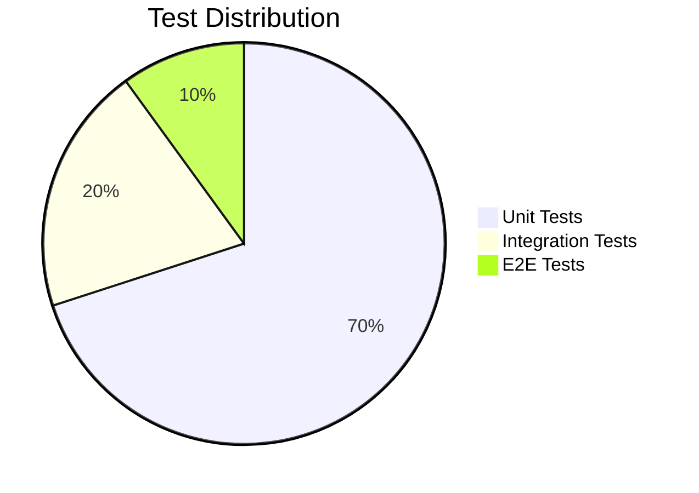
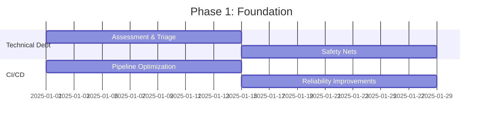

#  For Developer Only

> ### 🧭 About This Document
> This framework is a complete playbook for engineering teams to identify and fix recurring developer pain points — from technical debt to testing and collaboration.
> It’s structured to deliver **measurable improvements in productivity, quality, and reliability within 6 months** using practical, time-bound solutions.

---

## 🎯 Quick Navigation
| Section | Time to Read | Key Focus |
|---------|-------------|-----------|
| [🔧 Technical Debt](#-technical-debt) | 3 min | Code Quality |
| [⚡ CI/CD Pipeline](#-cicd-pipeline) | 2 min | Speed & Reliability |
| [🐛 Debugging](#-debugging) | 2 min | Issue Resolution |
| [🤝 Team Collaboration](#-team-collaboration) | 2 min | Knowledge Sharing |
| [🧪 Testing Strategy](#-testing-strategy) | 2 min | Quality Assurance |

---

## 🔧 Technical Debt
*"Code that's scary to touch"*

### 🚨 Common Issues
- 🔴 High complexity & outdated code  
- 📉 Missing documentation  
- 🧩 Low test coverage (<40%)  
- 🧨 Dependency vulnerabilities  
- 🧠 Knowledge silos  

### 🛠️ 90-Day Improvement Plan

#### 📅 Month 1: Safety First
```mermaid
graph TD
    A[Week 1–2: Assessment] --> B[Run Static Analysis]
    A --> C[Create Debt Backlog]
    B --> D[Week 3–4: Safety Nets]
    C --> D
    D --> E[Add Critical Tests]
    D --> F[Setup Monitoring]
````

**Actions:**

* Run `SonarQube` & `Snyk` scans
* Create technical debt backlog in Jira
* Add integration tests for critical paths
* Set up CI/CD quality gates & monitoring

#### 📅 Month 2: Incremental Improvement

* Allocate **20% sprint time** for debt reduction
* Apply “Boy Scout Rule” (leave code cleaner)
* Refactor high-impact modules

#### 📅 Month 3: Systematic Refactoring

* Conduct **refactoring sprints**
* Automate dependency updates
* Raise test coverage by 10% monthly

**Tools:** SonarQube, Snyk, JaCoCo, Jenkins, GitHub Actions

---

## ⚡ CI/CD Pipeline

*"Slow, unreliable deployments"*

### 🚨 Issues

* 🐢 Long builds (>30 min)
* 🔴 Flaky tests (10–30%)
* ⚙️ Inconsistent environments
* 🚨 Frequent rollbacks

### ⚙️ 3-Month Optimization Plan

#### Week 1: Measure & Optimize

* Track build/test/deploy durations
* Set goals: **build <10 min**, **deploy success >95%**

#### Week 2–3: Immediate Wins

```yaml
cache:
  key: "$CI_COMMIT_REF_SLUG"
  paths:
    - node_modules/
    - .gradle/caches/

parallel:
  matrix:
    - TEST_SUITE: [unit, integration, e2e]
```

* Parallel test execution
* Dependency caching
* Split monolithic test suites

#### Month 2–3: Scale & Automate

* Add canary deployments
* Use predictive test selection
* Monitor pipeline performance

**Tools:** Jenkins, GitLab CI, Docker, Kubernetes, Prometheus

---

## 🐛 Debugging

*"Finding bugs shouldn’t take half a day."*

### 🚨 Issues

* ⏳ 4+ hours to find root causes
* 📝 Poor log structure
* 🧩 Environment mismatches

### 🧰 Debugging Framework

#### Week 1: Standardize Logging

```javascript
logger.info('Payment success', {
  userId: '123',
  orderId: '456',
  duration: 210,
  correlationId: 'req-789'
});
```

* Structured JSON logs
* Centralized ELK stack
* Correlation IDs

#### Week 2–3: Monitoring

* APM setup (New Relic / DataDog)
* Synthetic monitoring for key flows
* Alert thresholds on metrics

#### Month 2: Advanced Observability

* Distributed tracing (Jaeger/Zipkin)
* Error tracking (Sentry)
* Weekly incident reviews

**Tools:** ELK Stack, DataDog, Jaeger, PagerDuty

---

## 🤝 Team Collaboration

*"Break silos, boost communication."*

### 🚨 Issues

* 🧠 Knowledge hoarding
* 📚 Outdated documentation
* 🐢 Slow onboarding (3+ months)

### 🏗️ Knowledge Sharing Plan

#### Week 1: Knowledge Audit

* Identify critical system owners
* Document gaps & onboarding pain points

#### Week 2–3: Foundation

```markdown
# Service Template
## Purpose
## Architecture
## Common Tasks
## Troubleshooting
```

* Central knowledge base (Confluence/Notion)
* Documentation reviews in PRs

#### Week 4–8: Build Habits

* Weekly knowledge sharing sessions
* Pair programming rotation
* Onboarding buddy system

**Tools:** Notion, Lucidchart, Slack, GitHub

---

## 🧪 Testing Strategy

*"Flaky tests kill trust."*

### 🚨 Issues

* 🎲 15–40% flaky test rate
* 🐌 Slow execution (>30 min)
* 🧩 Coverage gaps

### 🏗️ Testing Pyramid



#### Month 1: Stabilization

* Remove or fix flaky tests
* Add test retries
* Monitor performance

#### Month 2: Strengthening

```yaml
quality_gates:
  unit_tests: "95%"
  integration_tests: "90%"
  coverage: "80%"
```

* Implement CI quality gates
* Add contract & security testing

#### Month 3: Continuous Quality

* Mutation testing for core logic
* Test data management
* Team testing workshops

**Tools:** Jest, Cypress, Pact, JaCoCo, TestContainers

---

## 📅 Implementation Roadmap

### 🕒 Phase 1: Foundation (Weeks 1–4)



### 🕓 Phase 2: Systematic Improvement (Months 2–3)

* Expand automation
* Strengthen testing & documentation
* Improve cross-team visibility

### 🕕 Phase 3: Continuous Excellence (Month 4+)

* Maintain quality gates
* Review KPIs monthly
* Encourage innovation time

---

## 📊 Success Dashboard

| Category        | Metric            | Target  | Current |
| --------------- | ----------------- | ------- | ------- |
| **🚀 Speed**    | Build Time        | <10min  |         |
|                 | Test Feedback     | <5min   |         |
| **🛡️ Quality** | Test Coverage     | >80%    |         |
|                 | Bug Escape Rate   | <2%     |         |
| **🤝 Team**     | Onboarding Time   | 4 weeks |         |
|                 | Knowledge Sharing | 85%     |         |

---

## 🛠️ Tool Stack Recommendation

| Category             | Tools                              |
| -------------------- | ---------------------------------- |
| **🔧 Code Quality**  | SonarQube, ESLint, Prettier        |
| **⚡ CI/CD**          | GitHub Actions, GitLab CI, Jenkins |
| **🐛 Debugging**     | DataDog, New Relic, Jaeger         |
| **📚 Documentation** | Notion, Confluence, GitBook        |
| **🧪 Testing**       | Jest, Cypress, Selenium            |

---

## 💡 Pro Tips

### 🕐 Today

1. Run static analysis on your repo
2. Identify slowest CI/CD stages
3. Review flaky tests
4. Map knowledge silos

### 📅 This Week

1. Implement one “quick win”
2. Set up monitoring dashboards
3. Schedule a knowledge-sharing session

### 📈 This Month

1. Establish baseline metrics
2. Add CI quality gates
3. Conduct a retrospective

---

## 🧩 Final Note

This framework transforms engineering culture by enforcing **accountability, measurable progress, and continuous improvement**.
Adopt it iteratively — every week of consistency compounds into long-term developer excellence. 💪

---


